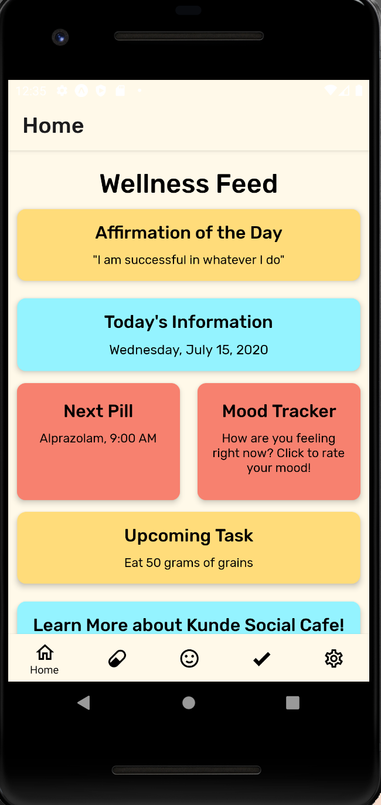
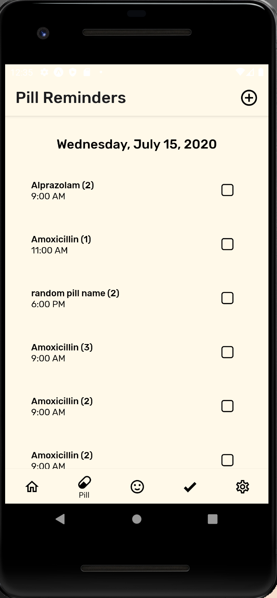
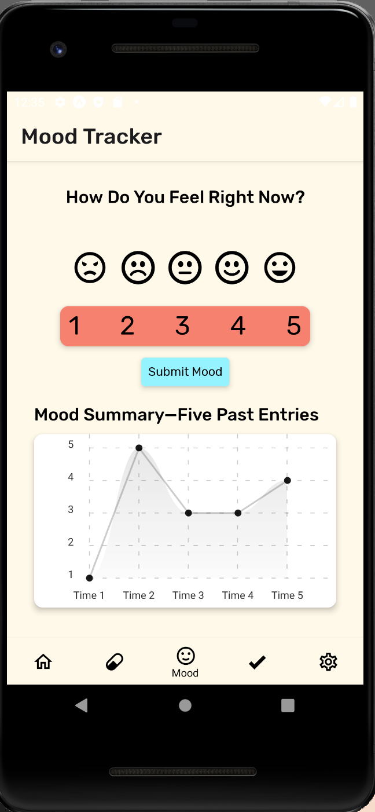
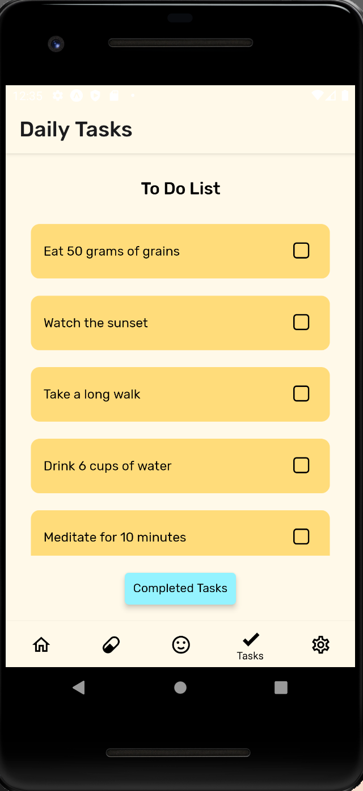
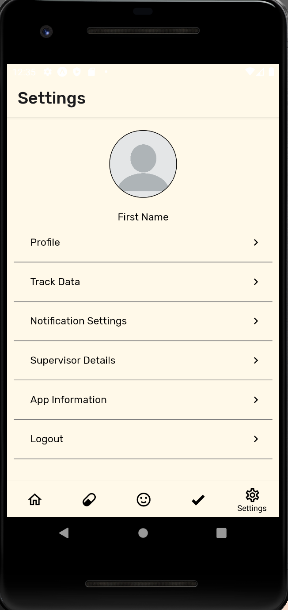

# kunde-app (in progress)

This is a mental wellness app for Kunde Social Cafe (an organization in Astana, Kazakhstan, that works to destigmatize disabilities and employ/rehabilitate people with disabilities) geared toward those with intellectual disabilities. Its three main features include pill reminders, mood tracking, and a task list. Below is a preview of what the app will look like!

Developed with React Native and Expo.

Main Feed Screen | Pill Reminder Screen | Mood Tracking Screen
---------------- | -------------------- | --------------------
 |   | 

Task List Screen | Settings Screen 
---------------- | ---------------
 | 

